# Connected Device Hub Flow and Where P2P Fits

## Purpose

This document defines how an application can use `TripleG3.P2P` as a generic connected-device hub.
The package provides device membership, routing, message delivery, and live-session communication.
It does not implement the consuming application, its users, its policy, or its business workflows.

## Responsibility Boundary

### The consuming application owns

- User authentication, login, and logout.
- Device authorization, approval, consent, and revocation policy.
- Selecting a destination device.
- Selecting and invoking application tools.
- Request, notification, and conversation storage.
- Processing remote requests and notifications.
- Deciding how to reconcile missed or conflicting application data.
- Any durable application state.

### `TripleG3.P2P` owns

- Maintaining the current in-memory connected-device membership.
- Notifying connected devices when membership changes.
- Returning a snapshot of currently connected devices.
- Routing opaque requests, acknowledgements, notifications, and broadcasts.
- Reporting transport delivery, timeout, and disconnection failures.
- Negotiating and carrying live-session control and data channels.
- Bounded, memory-only transport caches when needed for retries or duplicate suppression.

Authentication and approval may appear in a flow as external prerequisites. They are never performed
or interpreted by `TripleG3.P2P`.

## Terms

- **Application**
  - The consuming application using `TripleG3.P2P`.
  - Owns users, authorization, tools, queues, state, and business decisions.
- **OD — Originating Device**
  - The connected device that originates a request or session.
- **RD — Remote Device**
  - The connected device selected by the application to receive a request or session offer.
- **AD — All Devices**
  - All devices currently connected to the same application-defined network.
- **LD — Local Device**
  - The device on which the current operation is executing. It may be the OD or RD.
- **ND — New Device**
  - A device joining the connected-device network.
- **MD — Missing Device**
  - A device whose active connection is no longer responsive.
- **Device ID**
  - A stable, application-supplied identifier for a device.
- **Connection ID**
  - A unique identifier for one active device connection. A reconnect creates a new connection ID.
- **Membership Revision**
  - A monotonically increasing number assigned to each accepted membership change.
- **Connected Device Hub**
  - The in-memory P2P component that tracks connected devices, publishes membership changes, answers
    membership queries, routes messages, and coordinates live sessions.
- **Request Queue**
  - An application-owned queue for received remote requests.
- **Notification Queue**
  - An application-owned queue for received remote notifications or results.
- **Turn Cache**
  - An application-owned store of conversation or interaction turns.
- **Tool**
  - An application operation. `TripleG3.P2P` neither selects nor executes tools.
- **Tool Result**
  - An application result correlated with a tool invocation or remote request.
- **Middleware**
  - Application-owned logic that may validate, log, alter, cache, or route operations.
- **Live Session**
  - One or more related, potentially long-running communication channels between connected devices.
  - Examples include file transfer, audio, video, screen sharing, and remote input.
- **Live Session ID**
  - A unique identifier correlating the control messages and data channels of one live session.

## Connected-Device Model

The hub only requires transport-relevant connection information:

```text
ConnectedDevice
- DeviceId
- ConnectionId
- DisplayName or opaque descriptor
- Route or endpoint
- ConnectedAt
```

Application-defined metadata may be included for queries, but the hub treats it as opaque data. The
hub does not infer authorization, approval, user identity, tool availability, or business capability.

## Device Membership Flow

### Device joins

Authentication and authorization occur before this flow in the consuming application.

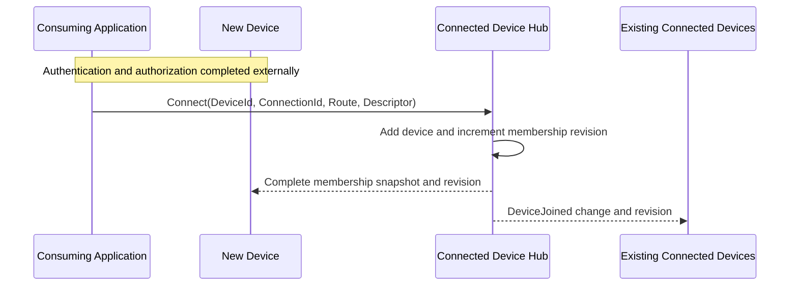

The ND receives a complete snapshot because it may not have observed earlier membership changes.

### Graceful leave

Logout is an application concern. The hub only observes an explicit disconnect request.

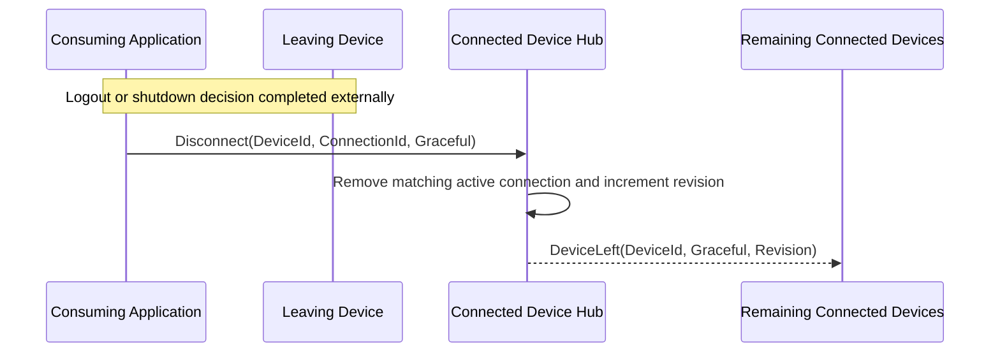

The connection ID prevents a stale connection from removing a newer connection for the same device.

### Unexpected disconnect

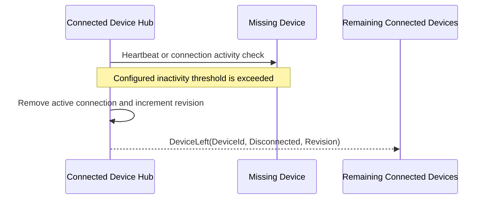

`Disconnected` means the current connection is unavailable. It does not mean the application has
deleted, logged out, or revoked the device.

### Membership synchronization

Every membership change carries its revision. If a device detects a revision gap, it requests a full
snapshot.

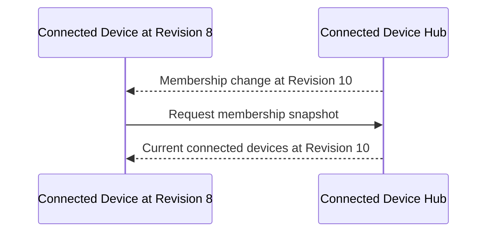

The initial design should use one application-selected membership coordinator for each connected-device
network. It assigns membership revisions and publishes snapshots. Coordinator election and durable
membership are outside the initial P2P scope.

## Query Connected Devices Flow

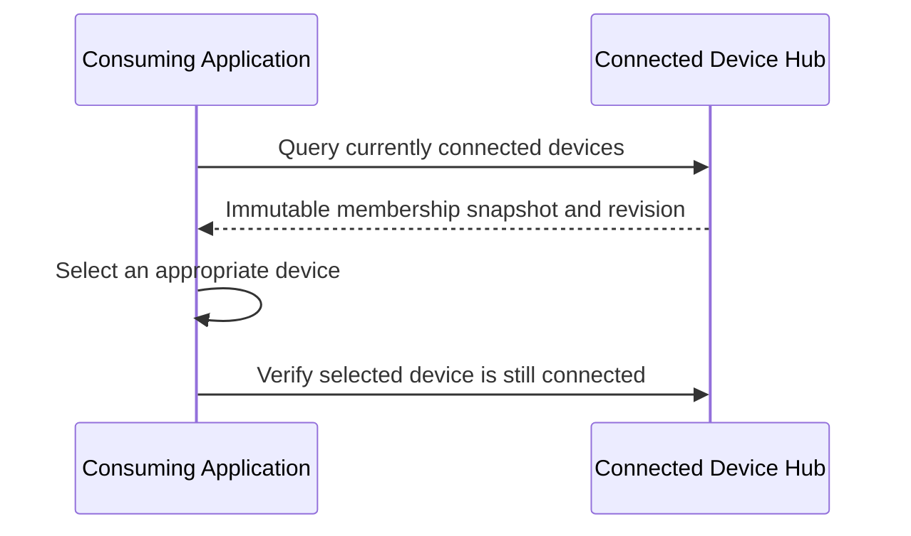

The hub reports available connections. The application decides which device to select. A disconnect
may race with the final check, so send operations must still report delivery failure or timeout.

## Send Request to Remote Device Flow

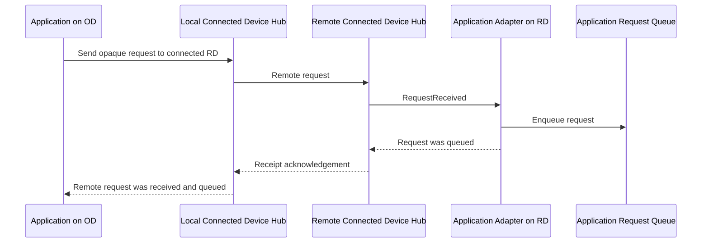

The receipt acknowledgement confirms delivery to the remote application queue. It does not claim that
the request is executing or complete.

Minimum correlation metadata should include:

- Request ID.
- Originating device ID.
- Destination device ID.
- Creation and expiry times when applicable.
- Opaque application payload or payload contract.

## Post-Request Notification Flow

Request processing is application-owned and happens independently after the request is queued.

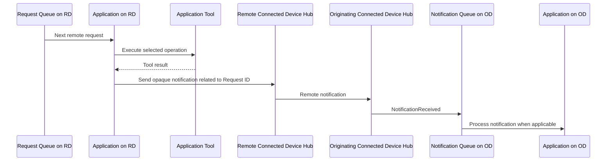

If the OD is disconnected, the consuming application decides whether to retain, reroute, or discard the
notification. P2P does not own durable notification storage.

## Turn Synchronization Flow

The consuming application owns turn storage, ordering, and conflict handling. P2P only broadcasts the
turn or cache-change message.

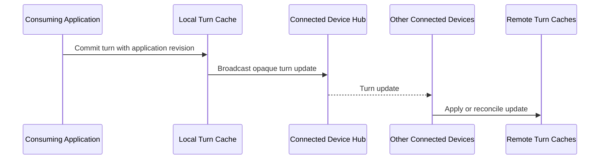

The application payload should provide its own conversation ID, turn ID, and sequence or revision so
the turn caches can detect missing or conflicting updates.

## Live Session Flow

A live session uses two planes:

- **Control plane** — reliable typed messages for offer, answer, start, status, stop, cancellation, and
  failure.
- **Data plane** — one or more transports selected for the session type.

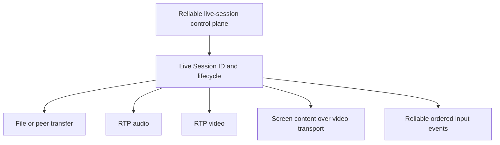

### Live-session establishment

Authentication, authorization, consent, and device selection occur in the consuming application before
it accepts or initiates the corresponding hub operation.

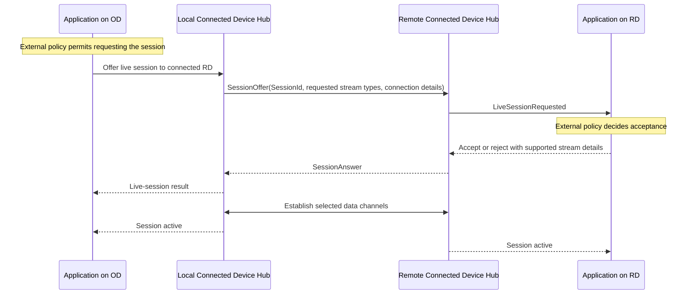

### Active live session

```text
OD <-> Reliable P2P control plane <-> RD
OD <-> Selected data channel(s) <-> RD
```

Data-plane selection:

| Session content | P2P data plane |
| --- | --- |
| File | File transfer or reusable peer-transfer session |
| Audio | RTP audio |
| Video | RTP video |
| Screen content | Screen capture supplied by the application and carried over RTP video |
| Keyboard or mouse | Reliable ordered control messages |

The application owns capture, encoding input, decoding output, rendering, file selection, destination
paths, and applying remote input. The P2P package only carries the resulting data.

### Live-session termination

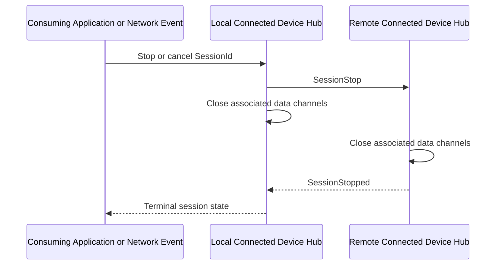

A device disconnect immediately invalidates every live session involving that connection ID.

### Live-session states

```text
Requested -> Accepted | Rejected
Accepted -> Starting
Starting -> Active | Failed
Active -> Stopping | Failed
Stopping -> Stopped
```

The hub reports session state and transport failures. It does not decide whether a session is permitted.

## Live-Session Safety Boundary

- Screen sharing, camera, microphone, files, and remote input are enabled only after the consuming
  application calls the corresponding accept/start operation.
- Viewing and remote input are separate stream types; accepting screen viewing does not implicitly
  enable keyboard or mouse input.
- A session or stream can be stopped at any time by the consuming application.
- Remote-input events require ordered delivery, rate limits, and stale-event rejection.
- Disconnecting either device closes every associated stream.
- Production media requires an authenticated and encrypted channel supplied or configured by the host.
  The P2P hub does not implement user authentication or approval policy.

## Connected Device Hub Summary

```text
ConnectedDeviceHub
├── Membership
│   ├── Connect
│   ├── Disconnect
│   ├── Detect missing connection
│   ├── Query connected devices
│   └── Synchronize membership snapshots and revisions
├── Messaging
│   ├── Send remote request
│   ├── Return receipt acknowledgement
│   ├── Send remote notification
│   └── Broadcast opaque application updates
└── Live Sessions
    ├── Offer and answer
    ├── Start and stop
    ├── Associate data channels
    └── Report state and transport failures
```

This is a communication hub, not an application, workflow engine, authorization service, or durable
data store.

